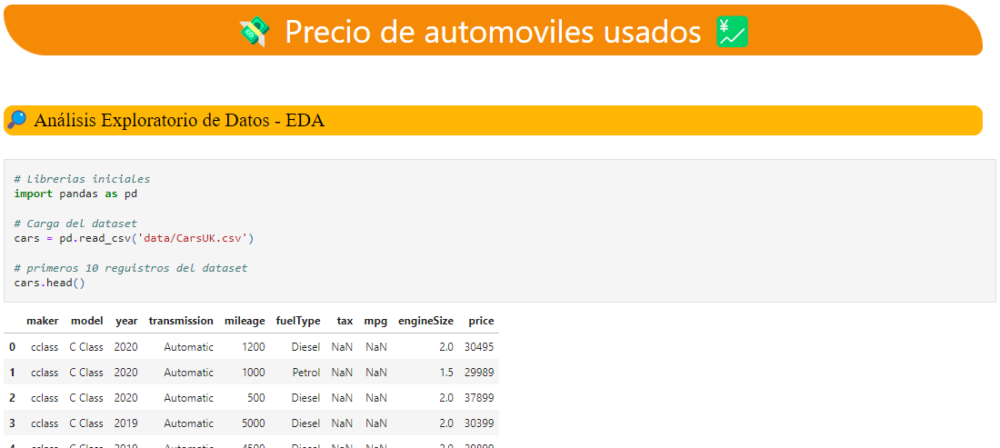

# Precios de carros en UK

Dataset en Kaggle: [100,000 UK Used Car Data set](https://www.kaggle.com/datasets/adityadesai13/used-car-dataset-ford-and-mercedes)

Dataset mediante GitHub: [cars.csv](https://raw.githubusercontent.com/fferegrino/cf-ml/main/car-prices/cars.csv)

# Notebook

Puedes visualizar el proceso que llevaron los datos en [Cars.ipynb](https://github.com/GilbertoNavaMarcos/car-price/blob/main/Cars.ipynb)